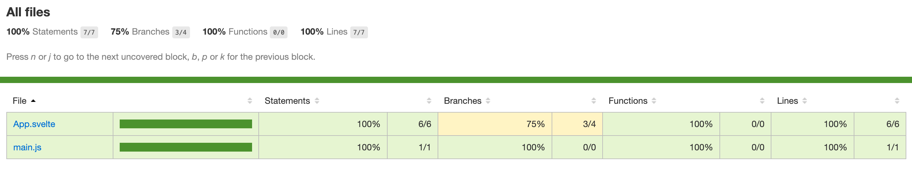
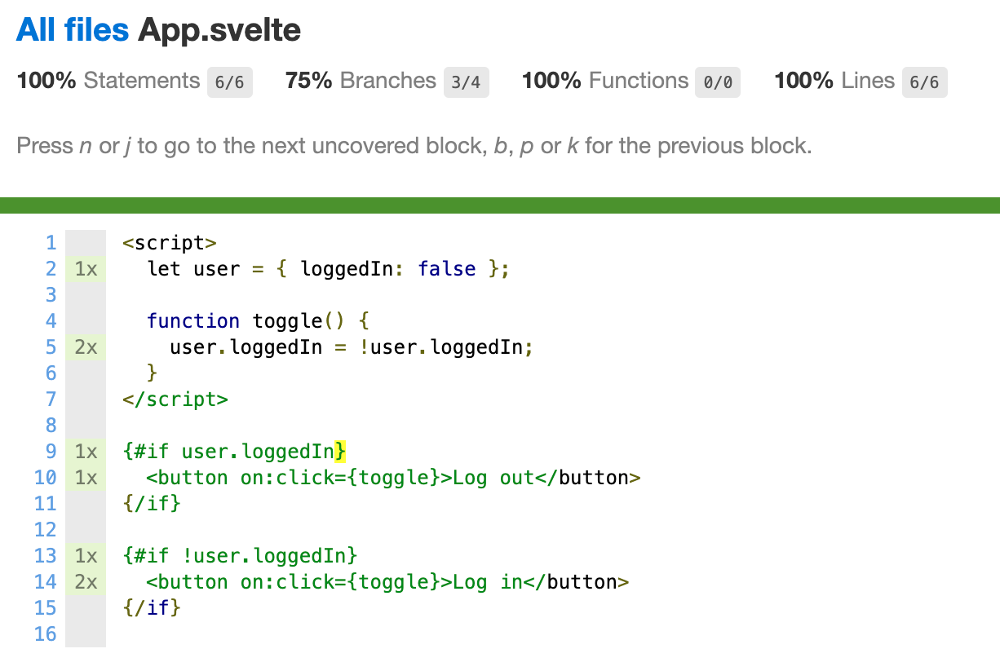

# coverage-example-svelte

Via [sveltejs/template](https://github.com/sveltejs/template).

## Results

- `npm install`
- `npm run e2e`, it will run the app on http://localhost:5000 and open Cypress Test Runner GUI,
- run `spec.js`,
- look at results in the `coverage` directory.

Here are the result from a sample run:





## Notable changes from the Svelte template

- Add Cypress, configure code coverage (see [references below](#References) for more details on how),
- App.svelte is a [Svelte 3 "User component" example](https://svelte.dev/examples#if-blocks),
- `rollup.config.json` : added `import istanbul from "rollup-plugin-istanbul";`,
- `rollup.config.json` : changed `sourcemap` to `"inline"`,
- `rollup.config.json` : added the istanbul plugin config:

```js
    // only instrument source code in development mode
    !production &&
      istanbul({
        // only instrument our files in "src" folder
        // which will instrument ".svelte" and ".js" files
        extensions: [".js", ".svelte"],
        include: ["src/**/*"],
        sourceMap: true,
        compact: false,
        debug: true
      }),
```

## rollup-istanbul-plugin

In order to make code coverage work, you'll need to `npm install --save-dev https://github.com/billowz/rollup-plugin-istanbul#rc`.
Please ask the original repo to merge the pull request and publish a new version: https://github.com/artberri/rollup-plugin-istanbul/pull/22

## References

- See [rollup.config.js](rollup.config.js)
- Read [Cypress code coverage guide](https://on.cypress.io/code-coverage)
