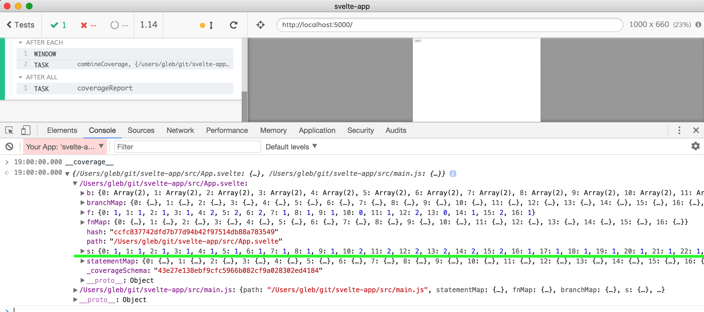
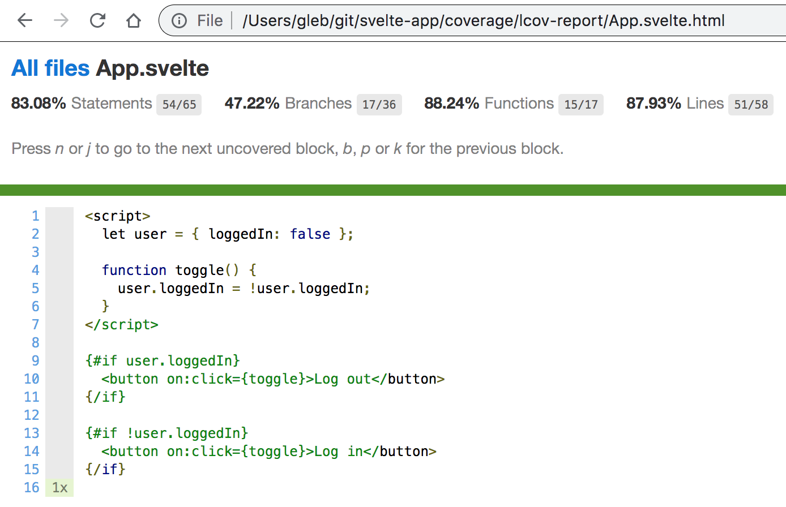

# coverage-example-svelte

**WIP**

Via [sveltejs/template](https://github.com/sveltejs/template)

Svelte 3 "User component" example from [https://svelte.dev/examples#if-blocks](https://svelte.dev/examples#if-blocks)

WIP: the code coverage seems to NOT map the source correctly for `.svelte` files. For example, the small file [src/App.svelte](src/App.svelte) shows so many statements ...

Even if the `.svelte` file generates lots of code, the back source transformation does not seem to map correctly at all.

Hmm, the numbers seem to be from the compiled JS code, not the original Svelte template code.

Use `npm run e2e` to run the test runner GUI

Also using fork [bahmutov/rollup-plugin-istanbul](https://github.com/bahmutov/rollup-plugin-istanbul) because the original version was behind times and did not have `dist` published.

See [rollup.config.js](rollup.config.js)

Read [Cypress code coverage guide](https://on.cypress.io/code-coverage)
